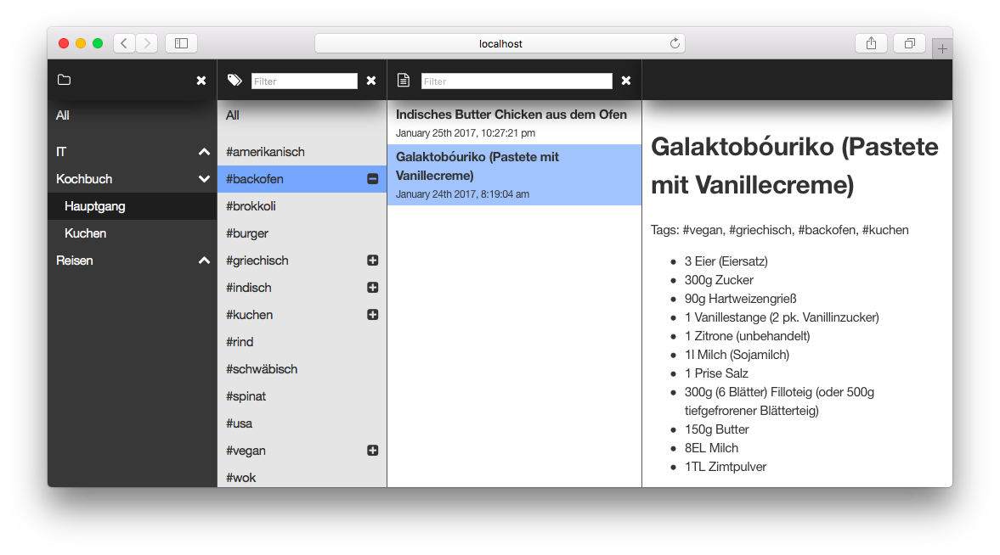

notes
===

This is a simple node application to show notes in the browser. The notes are simple markdown files which will be parsed at the startup. At the moment you have to restart the application to update the content.

